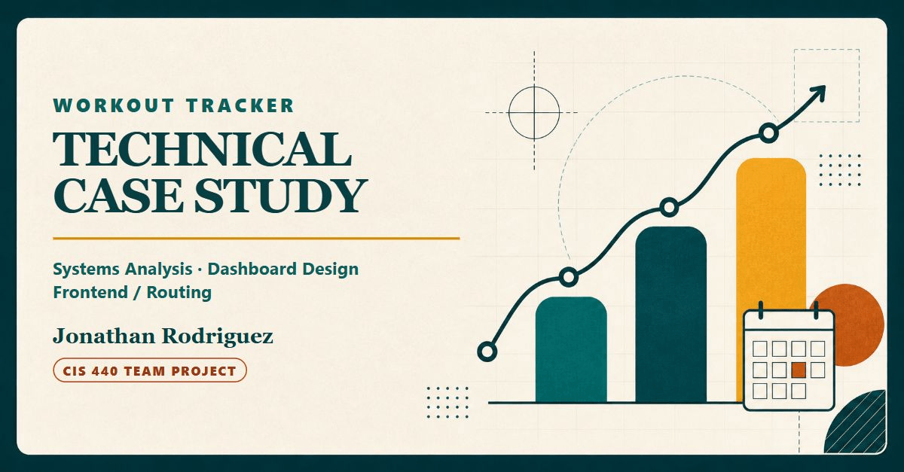

# Workout Tracker Technical Case Study

Systems analysis, workflow design, and dashboard thinking within a six-person academic web application.

**Jonathan Rodriguez — Frontend / Routing Contributor · Case-Study Maintainer**

**JavaScript · Node.js · Express · MySQL · HTML/CSS · Scrum**

[View the live case study](https://jonathangu4z.github.io/cis440-workout-tracker-case-study/) · [Read the detailed narrative](CASE_STUDY.md) · [Open the public repository](https://github.com/Jonathangu4z/cis440-workout-tracker-case-study)

## 30-second overview

| Question | Answer |
|---|---|
| **Problem** | Beginners face disconnected decisions when choosing exercises, planning a routine, logging a session, and interpreting progress. |
| **Context** | A six-person CIS 440 academic team designed and implemented a browser-based workout-tracking prototype. |
| **My role** | I contributed frontend and internal-page foundations, routing behavior, workout-entry and calendar prototypes, responsive catalog states, beginner planning, recovery reminders, configurable analytics, and selected maintenance. |
| **Stack** | JavaScript, Node.js, Express, MySQL, HTML/CSS, and Scrum. |
| **Demonstrates** | Requirements interpretation, system and data-flow analysis, dashboard design, failure-state thinking, technical troubleshooting, validation, and clear documentation. |

The product was intended to help a beginner move through a connected workflow: choose an exercise, plan or schedule activity, record the completed work, and review useful summaries. This repository presents the architecture, decisions, evidence, and limitations without publishing the application source or private project history.

## Verified contributions

My public contribution statements are limited to work supported by an evidence review of the private project history.

### Interface foundations and routing

I contributed dashboard and internal-page foundations, navigation wiring, and client-side token-presence routing behavior. The browser guard supported page flow and feedback; protected server routes remained the authorization boundary.

### Workout entry, calendar, and exercise catalog

I prototyped workout-entry and calendar flows with date handling, validation, reusable prior-entry behavior, and repeated entry creation. I also built responsive exercise-catalog states with grouped content, skeleton loading, bounded initial lists, and expansion controls.

### Beginner planning and reminders

I built a beginner routine-planning flow around training days, equipment, start date, and a multi-week preview. I added transparent repeated-muscle-group and recovery reminder heuristics with duplicate-notice suppression. These prompts were general interface guidance, not medical advice.

### Dashboard analytics and maintenance

I designed configurable workout-history views with summary metrics, line and bar chart modes, presets, saved display configuration, and insight cards. My maintenance work was limited to selected naming, browser, routing, and server-startup fixes.

Shared backend, database, authentication, design, testing, integration, and product work remain described as team-developed. I do not assign those areas to myself without specific evidence.

## Architecture and data flow

```text
Browser interface and client state
        |
        | HTTP requests and protected-route token
        v
Node.js / Express routes and business rules
        |
        | Parameterized queries
        v
MySQL users, exercises, workouts, entries, and schedules

Optional boundary: Express <-> Google OAuth and Calendar APIs
```

A representative reporting path begins with a signed-in browser submitting a workout and its entries. The server validates the request and persists user-scoped records. History endpoints return owned data, and browser-side logic converts that data into summary metrics and chart-ready series. Optional calendar behavior sits at a separate provider boundary and was not validated live for this presentation.

## Transferable analyst skills

| Professional lens | Evidence demonstrated in the project |
|---|---|
| **IT / Systems Analysis** | Traced browser, API, database, and provider boundaries; documented workflows and failure states; distinguished navigation behavior from server authorization; recorded test limits. |
| **Business Intelligence / Reporting** | Defined dashboard summaries, configurable chart modes, empty states, and report behavior; explained how workout history becomes readable metrics without inventing business impact. |
| **Business / Product Analysis** | Framed the beginner-user problem, translated needs into workflows and features, documented tradeoffs, and balanced usability, privacy, technical constraints, and team scope. |
| **Technical Implementation** | Built responsive browser interfaces, routing and state behavior, form validation, loading/empty/error states, and JavaScript integration within a Node/Express/MySQL application. |

The project does not establish enterprise BI-platform experience, Power BI or Tableau implementation, production adoption, or measurable business outcomes. It demonstrates the underlying analysis and reporting habits at academic-project scale.

## Validation and confidence boundaries

The case-study presentation is checked for its exact public inventory, semantic HTML, local links and assets, canonical and sharing metadata, social-card dimensions, keyboard focus support, reduced-motion and forced-color handling, responsive layouts, privacy, and banned internal-process language.

Recorded application evidence covered dependency installation and audit at the time of review, syntax and import checks, and six bounded no-database smoke/security-regression tests. Those results are a historical validation snapshot—not a current security guarantee or production certification.

Not claimed as complete:

- production application deployment, scale, availability, or active users;
- live Google OAuth or Calendar validation;
- end-to-end MySQL workflow testing;
- formal accessibility conformance or full assistive-technology review;
- complete security, clinical effectiveness, revenue, retention, or adoption impact.

## Team context and attribution

The underlying application was developed by a six-person academic team with Scrum Master, Product Owner, database/ERD, frontend/UI, frontend/routing, and backend/API responsibilities. Roles describe collaboration context and do not imply exclusive ownership of every feature.

Independent portfolio case study of a team-developed academic project. I do not claim sole authorship or team/university endorsement. Other contributors are not named in this public presentation.

## What to inspect next

- Use the [live site](https://jonathangu4z.github.io/cis440-workout-tracker-case-study/) for the fastest recruiter-oriented walkthrough.
- Read [CASE_STUDY.md](CASE_STUDY.md) for requirements, contribution evidence, architecture, reporting logic, technical tradeoffs, troubleshooting lessons, and prioritized improvements.
- Review [NOTICE.md](NOTICE.md) for the durable provenance, privacy, media, evidence, and reuse boundaries.
- Open [TEAM_SHARING.md](TEAM_SHARING.md) for a neutral project description, role placeholders, and correction guidance for original teammates.

For durable provenance, media, privacy, and reuse details, see [NOTICE.md](NOTICE.md). Original teammates can use the neutral guidance in [TEAM_SHARING.md](TEAM_SHARING.md) to describe their own verified roles or request corrections and naming changes.
